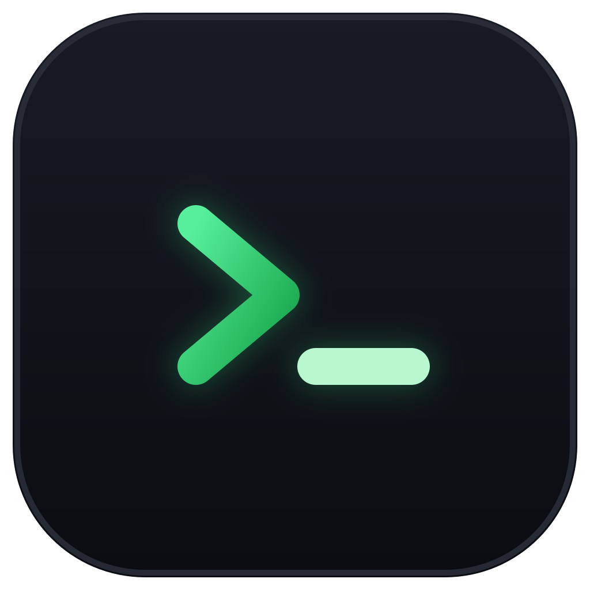

# Ccode

<p>
  
</p>

**AI 编码 Agent 统一启动器 + 配置中心 + 会话监控台**（桌面应用，Tauri v2 + React/TS + Rust）。

为 Claude Code、Codex、Gemini CLI、Qwen Code、OpenCode、Kimi Code 六个终端 agent 管理多套 API 配置（端点/密钥/模型），内嵌终端一键拉起，并解析各 CLI 本地会话文件做可视化浏览与工作区编排。

## 功能

- **配置中心（⇄）**：agent × profile 多配置管理，多模型切换，密钥 0600 本地存储绝不回显；默认启动注入环境变量（零污染），可选「设为全局默认」（写前备份）；CLI 安装/更新一键完成
- **工作区（⛁）**：任务级 git worktree 隔离（`ccode/<任务名>` 分支），多任务并行互不污染；`.ccode/settings.toml` 项目自动化（files-to-copy、setup/archive 脚本、端口段注入）；评审流：任务 diff、健康状态、本地合并、gh PR
- **终端（⌨）**：内嵌 xterm.js 多标签终端，agent 退出自动回落登录 shell、会话可一键恢复；Monaco 文件预览/编辑 + git 改动面板 + ⌘F 输出搜索；◈ AI 生成提交信息
- **会话（◔）**：解析六个 CLI 的本地会话文件做结构化回放（含外部终端里运行的会话）；pin 快照保留、标签/归档/搜索、批量删除、◈ AI 摘要、Markdown 导出
- **技能（✦）**：Skills 统一库 + 六 CLI 分发（symlink/copy），目录/ZIP/GitHub 四路导入，ZIP 导出
- **统计（◫）**：token 用量与费用统计（官方价口径，$/¥ 切换），agent 占比进度条、项目/模型分布
- **设置（⛭）**：七套深色主题、终端字体/调色板、AI 专用配置、应用内自动更新、诊断日志

## 安装

从 [Releases](../../releases) 下载，按你的平台选择：

| 平台 | 选哪个 | 说明 |
|---|---|---|
| macOS（Apple 芯片 M1/M2/M3/M4） | `Ccode_x.x.x_aarch64.dmg` | 目前唯一 macOS 包；Intel Mac 暂需自行 `npm run tauri build` 构建 |
| Windows | `Ccode_x.x.x_x64-setup.exe` | 推荐，安装向导简单；`x64_en-US.msi` 适合企业批量部署，二选一即可 |
| Linux（Debian/Ubuntu） | `Ccode_x.x.x_amd64.deb` | `sudo dpkg -i` 安装 |
| Linux（Fedora/RHEL/openSUSE） | `Ccode-x.x.x-1.x86_64.rpm` | `sudo rpm -i` 安装 |
| Linux（其他发行版） | `Ccode_x.x.x_amd64.AppImage` | 免安装，chmod +x 后直接运行 |

其余 `.sig`、`latest.json`、`.app.tar.gz` 是应用内自动更新用的签名文件，**不用手动下载**。

不确定自己的芯片？macOS：左上角  → 关于本机，看「芯片」一栏；Windows：设置 → 系统 → 关于，看「系统类型」（基本都是 x64）。

> **macOS 注意**：应用暂未做 Apple 签名公证，首次打开如提示「已损坏」，终端执行：
> ```bash
> xattr -cr /Applications/Ccode.app
> ```

之后的版本更新可在应用内「设置 → 更新」一键完成。

## 文档

- [docs/user-guide.md](docs/user-guide.md) — 使用手册（完整操作流程）
- [CHANGELOG.md](CHANGELOG.md) — 版本更新日志
- [docs/architecture.md](docs/architecture.md) — 架构设计与决策记录
- [docs/agent-integration-matrix.md](docs/agent-integration-matrix.md) — 六个 CLI 的 env/配置/会话格式调研
- [AGENTS.md](AGENTS.md) — 开发约定与踩坑记录

## 开发

```bash
export PATH="$HOME/.cargo/bin:$PATH"   # Rust 不在默认 PATH 时

npm install
npm run tauri dev        # 开发（前端 HMR + Rust 自动重启）
npm run build            # 前端构建（tsc + vite）
cd src-tauri && cargo test
npm run tauri build      # 打包
```

三平台 CI：tag `v*` 或手动 dispatch 触发，跑全量测试后打三平台安装包并创建 Release 草稿（含自动更新签名包）。

## 技术栈

Tauri v2 · React 19 · TypeScript · Tailwind CSS v4 · zustand · xterm.js · Monaco Editor · Rust（rusqlite / portable-pty / notify）
