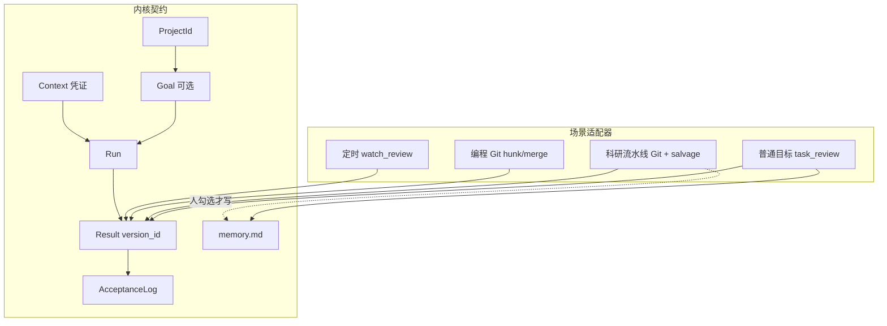
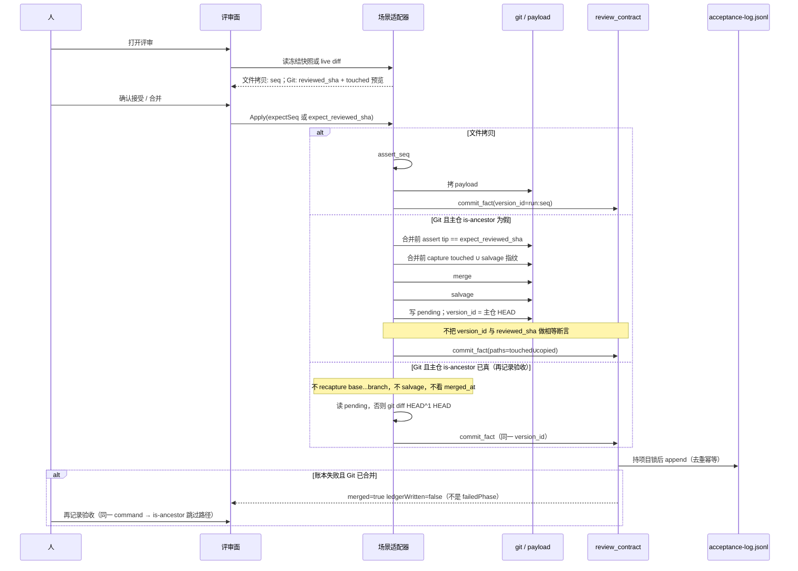
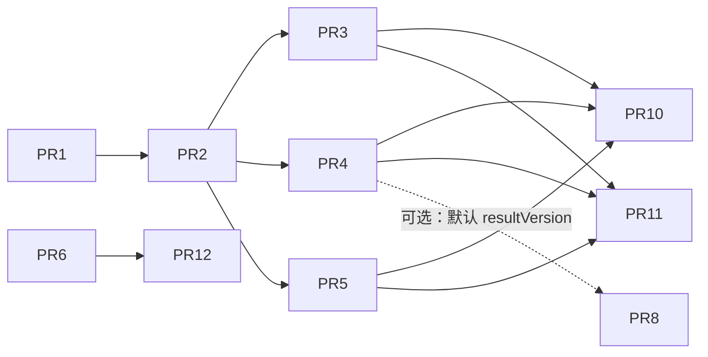

# Mesa 可信项目工作台：内核契约与科研半自动化流程保留

| 字段 | 值 |
|---|---|
| 作者 | Mesa |
| 日期 | 2026-09-09 |
| 状态 | **Accepted（2026-09-10 用户「全部执行」）**。决策已写入 `docs/architecture.md` §10。 |
| 仓库 | `/Users/tongzhouhong/Documents/Ccode`，分支 `main`，对照提交 `c1c48db`（审计基线 `30ee84e` 之后已落地整改） |
| 范围 | 把 Mesa 收成可信的 AI Project Workspace；**科研半自动化流程必须保留** |
| 前置 | `docs/architecture.md` §10；`docs/audits/architecture-audit-2026-09-09.md`；`docs/audits/remediation-handoff-2026-09-09.md`；`docs/conventions/review-freeze.md`；`docs/conventions/agent-workbench.md`；`docs/conventions/pipeline.md` |

> 本文是实现规格，不是愿景稿。函数名、表名、文件路径均对应当前代码。拍板后才进 §10。

---

## Overview

审计结论 B（2026-09-09）仍然成立：方向对，但三条边界没收齐——**Project 作为可重建的工作环境**、**Agent 产出作为有版本的待审结果**、**Review 同时更新文件 / 验收事实 / 长期知识**。普通目标链路（`task_review.rs` + `runs.rs` 的 `task_adopt_outputs_impl` + `.ccode/acceptance-log.jsonl`）已经接近这套内核；科研工作区合并、编程 `merge_at`、定时 `adopt_watch_run` 仍只完成「把文件写回主仓」，不写同一本验收账本，也不把科研质量证据挂到结果版本上。

本方案不另起 ChangeSet 事件源，不重写流水线，不合并两套 worktree 库。做法是：**抽出一层共享 Review 契约（基线 / 保护路径 / 版本身份 / 预览与写入绑定 / 账本 / 知识沉淀）**，四条回流路径做场景适配器。科研半自动化流程（模板、`steps[]`、工作区、TASK.md、Git 评审、口径 C 的 `copy_untracked_deliverables`、硬暂停决定、复现、`.ccode/research-acceptance.json`）全部保留，作为**显式专业分阶段表面**，不是被自由目标取代的遗留代码。

默认工作面仍然是：无流程科研 / 办公走自由目标；有流程科研走步进器。Agent 再强也不自动拆任务、不智能路由。

---

## Background & Motivation

### 当前真实结构

系统不是统一的 `Project → Goal → Result → Review` 内核，而是共享桌面基础设施 + 项目注册 + **四条按场景建立的执行和回流链路**：

| 场景 | 执行 | 版本证据 | 写回 | 验收事实 | 质量层 |
|---|---|---|---|---|---|
| 普通目标 `free_research` / `office_doc` | `src/goal-run.ts` → `task_prepare_run` | `task_review::{write_baseline, freeze_or_refresh}`，`review/<run>/payload` + `seq` | `task_adopt_outputs_impl`，三向判定，写入源只认 payload | **已写** `append_acceptance_log_at`（按 `run_id`+`goal_id` 去重） | 无独立科学结论层 |
| 科研流水线 | `src/pipeline-start.ts` → 工作区 + TASK.md | Git 分支 / 工作区 HEAD（**评审弹层现读 diff，无冻结 token**） | `workspaces::merge_impl_with_guard`：`git merge --no-ff` + `copy_untracked_deliverables` | **不写** acceptance-log；只改 `workspaces.merged_at` | `.ccode/research-acceptance.json` **绑 `workspace_id`+`step_name`**；复现目录绑 `workspace_id` |
| 编程车道 | `coding.rs` 工作树 | Git 分支（现读） | `coding::merge_at`：保护路径检查 + merge | **不写** acceptance-log | 无项目级接受记录；PR 是 GitHub 请求不是验收 |
| 定时巡检 | `scheduler.rs` 隔离 worktree | `watch_review::{prepare, freeze_at}`，`<config>/ccode/watch-reviews/<run>.json` | `adopt_watch_run` → `watch_review::adopt_at` | **不写** acceptance-log；只 `mark_run_adopted` | 技能契约 `watch_adopt_patterns_for` |

身份层：档案卡顶层 `id` 已稳定（`projects::ensure_project_id_at` / `register_at` 认回移动目录）；`tasks`/`runs` 已双写 `project_id` 并 `backfill_project_ids`。读取侧仍是路径：

```sql
-- runs.rs list_tasks_at
SELECT … FROM tasks WHERE (?1 IS NULL OR project_root=?1) AND …
```

`workspaces.repo_path`、`coding_lanes.repo_path`、`session_meta.project_path` 均无 `project_id`。目录一搬家，身份认回了，历史目标 / 会话 / 工作区分组仍指旧路径。

### 痛点（不是四个 P1 尾巴能单独收口的）

1. **「写回文件」≠「项目接受了某个版本的结果」**。科研合并、编程合并、定时采纳成功后，`.ccode/acceptance-log.jsonl` 无记录；`project-status.json` 也不接收这三类。人无法回答「这份 notes/xxx.md 是哪次验收进来的」。
2. **科研质量绑在工作区对象上**。`research_run_reproduce` 要求 `workspaces.status == "active"`（`research_quality::active_workspace`）；归档后复现记录还在 `~/ccode/reproductions/<workspace_id>/`，但验收查找键是 `workspace_id + step_name`。工作区是隔离容器，不是结果版本。
3. **Git 路径没有「人看过的版本」**。普通目标有 `expectSeq`；科研 `WorkspaceReviewView` 打开的是 live diff，合并时工作区可能已继续提交。未跟踪派生产物走 `copy_untracked_deliverables` 现拷，哈希不绑定。
4. **自由目标与流水线两套上下文**。普通目标冻结 `context.json`；科研以工作区 TASK.md 为凭证（正确，不要重复冻全文）。缺的是共享的**数据收集**（规则 / 保护路径 / memory / 技能版本），不是再造一份 Context Pack。
5. 只做审计留下的四件 P1（读取侧 `project_id`、解绑 `research_quality`、四条回流写账本、独立 Result Readiness 字段）**仍不够**：没有 Review 契约，四条路径会各写各的 JSON；没有版本身份规则，账本只是又一份日志；没有明确「流水线在内核里的插头」，后续会有人把 Workflow 删掉或强行改成自由目标。

### 已落地、本方案必须当前提而不是重做的

- 口径 C：派生产物写工作区，合并带回；文献 PDF / 人工导入直写 `papers/`；`＋新对话` 默认改项目根；定时 sentinel 显式。
- 普通目标：开工基线、收尾/回合冻结、三向采纳、`expectSeq`、`acceptance-log.jsonl`、归档恢复、`memory.md` 人确认、`context.json`、`src/goal-run.ts`、项目技能池。
- Run 可以没有 Goal（scratch / reader / 办公闲聊 `task_id` NULL）。
- 科研：`project.toml` `steps[]`、工作区、TASK.md、硬暂停决定、复现输出独立目录、科学验收与 Git 合并分开。
- 编程 / 科研两套 worktree 库不合并。

---

## Goals & Non-Goals

### Goals

1. 定义**内核对象与 Review 契约**，四条回流路径适配，而不是四套各写各的完成定义。
2. **保留并插头化科研半自动化流程**：模板、步骤、工作区、TASK.md、Git 评审、salvage 拷贝、质量/复现/结论验收全部留下。一步合并必须产生「文件准入」验收事实；科学结论仍是另一次人拍板，挂到**结果版本**而不只挂 `workspace_id`。
3. 成果版本身份：**禁止 Run 次数、禁止 mtime 权威**。普通目标继续 payload 冻结（预览与写入绑定同一 `seq`）；科研/编程拆成两个 Git token——人看过的是工作树 tip（`reviewed_sha`，合并**前**校验），账本记的是主仓合并后 `HEAD`（`version_id`）；定时用已有冻结快照。
4. Project 身份：路径是位置，`id` 是身份。读取侧按 `project_id` 渐进切流，不重写全部存储。工作区/车道在搬家重连时更新位置缓存（K21），不把 gitdir 修复吹成已完成。
5. 执行状态 / 结果可审 / 目标完成三分：可审由派生枚举表达（`none | reviewable | blocked | applied | ledger_pending`），**不**复用 `ready_to_merge`，不新造 Run 状态列。目标完成只由人接受。
6. Memory 仍是 `.ccode/memory.md`，只进人确认内容。
7. UI 不重做导航。项目内仍是任务 / 文件 / Agents；有流程科研保留步进器。把账本与版本可见性伸到现有评审面，不新开第九页。

### Non-Goals（审计 §9 + 架构 §11.5，全部维持否决）

- 自动 DAG / 智能路由 / 自研 Agent tool-call 循环 / Cloud Runtime / 团队同步
- 向量数据库记忆、插件市场、应用内 PPT/Word 编辑器
- 为「AI OS」重做八页导航
- 把科研 `workspaces` 与编程 `coding.rs` 并成一个库
- 把 Conversation 与 Run 合并；把 Skill 与 Workflow 合并
- 把科学结论验收与 Git 合并合成一个绿灯
- 新建通用 ChangeSet 表 + 事件源（替代四条适配器）
- 重写全部存储主键为 UUID
- 30 篇文献 = 30 个 Goal/Task
- 为「引导式（Agent 提议、人决定）」新建 Step 表
- 科研 TASK.md 再复制一份 `context.json` 全文冻结（落盘本身就是凭证）
- 本草案未拍板之前写入 `docs/architecture.md` §10

---

## Key Decisions

Key Decisions 已含用户 2026-09-09 对开放问题的拍板（K6/K7、K8、K14/`session_meta`、K11 首批 tip 校验）。本节不再留未决项。全文仍为 Draft，进 §10 需用户另说。

| # | 决策 | 默认 | 理由 |
|---|---|---|---|
| K1 | 架构形态 | **内核契约 + 场景适配器**（方案 C） | 普通目标已是内核；另起事件源或只补四个 P1 都不够。不重写流水线/编程 Git。 |
| K2 | 科研流程位置 | **显式专业分阶段表面，保留对象**；默认自主工作仍是自由目标 | 用户原话「科研半自动化流程要保留」。审计也说 Workflow 弱化为非默认表面，不是删除。 |
| K3 | 引导式工作 | **不新建 Step 表**；复用硬暂停 + 目标意见回流 + 话题卡 | Agent 提议发生在对话里，人决定才变成 Goal 或开下一步。 |
| K4 | Review 契约范围 | 共享：保护路径、版本身份、预览=写入、账本、可选 memory；**不统一 Git vs 文件拷贝实现** | Git 三向是 git 的工作；文件拷贝三向已在 `task_review::check_adoption` / `watch_review::adopt_at`。 |
| K5 | 引擎数量 | **不建第三套冻结引擎**。抽出薄模块 `review_contract.rs` 只管家账本与版本 token 校验 | `task_review` 与 `watch_review` 同构但范围不同（任意输出 vs 契约白名单），合并实现会伤两边。 |
| K6 | 科研 Git 合并是否写账本 | **写。`kind=pipeline_merge`，表示「这版文件进了主仓」。合并按钮 = 文件准入 + 记账，不要额外「接受这一步」。**（用户 2026-09-09 确认） | 这正是「写回 ≠ 接受事实」的缺口。 |
| K7 | 科研合并是否等于科学验收 | **不等于。** `.ccode/research-acceptance.json` 仍要人点「接受 / 有条件接受 / 退回」。（用户 2026-09-09 确认） | pipeline.md 已决：运行结束、计算检查、人工科研验收三层不得合成绿灯。 |
| K8 | 编程合并/PR 是否写账本 | **合进基准写 `kind=coding_merge`；开 PR 不写。**（用户 2026-09-09 确认） | PR 是请求，不是项目接受。合进基准才改变主仓文件。 |
| K9 | 定时采纳 | **写 `kind=watch_adopt`**，复用现有冻结，不改契约展开规则 | 与 K6 同一缺口。 |
| K10 | 成果版本身份 | 普通目标 = `run_id` + `seq`（同一 token 预览与写入）。定时 = watch snapshot `run_id`。科研/编程 = **两个 Git token**：`reviewed_sha`（工作树/功能分支 tip，人看过的）与 `version_id`（主仓 **merge 之后** 的 `HEAD`，写入账本）。二者不得当作同一值去 `assert`。 | `git merge --no-ff` 后 HEAD 永远不是功能分支 tip；编程 `merge --no-edit` 无 `--no-ff`，快进时偶发相等、非快进则不等。禁止 Run 计数与 mtime。 |
| K11 | Git 路径预览绑定 | **首批即做**（用户覆盖原「v1.1 / 第二批」默认）：打开评审记下 `reviewed_sha`；合并路径 Apply **先** `assert_reviewed_sha(expect, current_feature_tip)`，再 merge；合并**前**采集 `touched`；合并**后**主仓 `HEAD` 才是账本 `version_id`。禁止把合并后 HEAD 传入该断言。「再记录验收」跳过路径不校验 tip。 | 用户认为「看完又提交被一并合并」比「先有账本再绑 tip」更痛。对标 `expectSeq` 的是人看过的 tip，不是 merge commit。 |
| K12 | Result Readiness | **派生，不新增 `runs` 状态列**。闭集 `none \| reviewable \| blocked \| applied \| ledger_pending`。Git 的 `reviewable` **不**等于 `health_impl.ready_to_merge`。`applied` 的键与该 kind 的账本去重键相同。 | `ready_to_merge` 是「此刻能不能点合并」（主仓干净、ahead>0、无冲突）。可审成果在主仓脏/有冲突时仍然存在。账本失败必须能看见 `ledger_pending`，不能因 ahead==0 显示 `none`。 |
| K13 | 目标完成 | **只由人接受**。Run `completed` 不是 Goal `completed` | 已决。流水线「步骤完成」= 合并准入；科学完成 = research acceptance。 |
| K14 | ProjectId 读取切流 v1 | **`tasks`/`runs`：Rust 分支查询**（见 §6.1），禁止 `?1 IS NULL OR project_id=?1` 单句。`session_meta` **本波只双写 + 过滤 OR id，扫描器仍按路径**；全量读取切流不进 v1。（用户 2026-09-09 确认）工作区/车道见 K21。 | 搬家后目标列表必须还在。会话扫描以 CLI cwd 为事实，过早切 id 有误匹配风险。 |
| K15 | Memory | 物理存储仍 `.ccode/memory.md`；只进人确认。**本波不做 Agent 提议区、不做向量库** | 已落地最小闭环。提议区可后置，不阻塞内核。 |
| K16 | 上下文 | 普通目标继续 `context.json`；科研继续 TASK.md 落盘。共享收集函数只抽「规则/保护路径/memory/技能版本/文件地图」 | 避免双轨全文。 |
| K17 | UI | **不改 `ProjectSurfaceTab = tasks \| files \| agents`**。成果与验收 = 任务页既有评审区 + 账本只读段扩展；有流程保留步进器 | 用户要求不重做导航、不新开第九页。 |
| K18 | `project-status.json` | **继续只投影普通目标最近 20 条**。流水线/编程/定时不挤进按目标名替换的摘要 | 步骤名与目标名不是同一命名空间。长期事实以 jsonl 为准。 |
| K19 | 文献规模 | 一篇综述步骤处理 N 篇论文；论文是资源不是 Goal | 避免 30 篇 = 30 Task。 |
| K20 | 内部身份 | 展示名 Mesa，内部仍 `ccode`（`.ccode/`、`~/ccode/`、bundle id） | 已决，禁止顺手改。 |
| K21 | 搬家后工作区/车道身份（选项 A） | **位置缓存跟着项目走，gitdir 空洞明示**。`register_at` 移动重连时把 `workspaces.repo_path` / `coding_lanes.repo_path` 改成新 `projects.path`（位置，不是身份）。`WorkspaceDto` / `CodingLaneDto` 加 `projectId`。前端按 id 分组，回落 `samePath`。`merge_impl` 经 `project_id` 取当前 `projects.path` 当主仓，不信行内过期 `repo_path`。**不**声称 git worktree 的 gitdir 仍指向新主仓——脱节时 `health_impl` 报「工作树与主仓脱节，请重新挂载」，拒绝合并。 | 选项 B（v1 只保证 tasks/runs）会让「项目是可重建环境」在工作区列表上说谎。A 修的是 Mesa 登记与 UI 归属；物理 `.git` 指针是 git 的事，必须单独警告。 |
| K22 | Git 合并账本重试 | **跳过 `git merge` 的唯一条件**：主仓上 `git merge-base --is-ancestor {branch} HEAD`（`merge_at` 同句）。**禁止**用 `merged_at` 当跳过键——保留工作区后再提交时该列仍在，新提交必须再 merge，并产生新的 merge commit 与新的账本 SHA。「再记录验收」走同一 command：不 recapture 空的 `{base}...{branch}`，不跑 salvage；git `paths` 从 pending fact 或 merge commit（`git diff --name-only HEAD^1 HEAD`）重建。账本失败 **不得** 写入 `failedPhase`。返回 `merged=true, ledgerWritten=false`。 | 今日 `merged_at` 在 merge-keep 后一直留着，UI 只靠 `ahead>0` 再显示合并。用它跳过 git 会把后续提交吞掉。重试再 salvage 会把已进主仓的文件标成冲突，且违反 K23。 |
| K23 | 未跟踪产物与去重 | v1：salvage 只挂在**有 git ahead 的那次合并**的同一行 fact 上（`paths` = 合并前 `touched` ∪ `salvage.copied`）。去重键 `kind + version_id`（merge SHA）。ahead==0 之后新出现的 gitignored 文件 **不**另写账本行（已知洞，禁止用同一 SHA 覆盖 fingerprints 假装新准入）。后续若做，另开 `kind=pipeline_salvage`，`version_id = "{sha}:{fingerprint_digest}"`。 | 口径 C 的派生产物不进 Git；用 SHA 去重则同一 HEAD 下无法表达第二次 salvage。v1 不装这个洞，写清楚。 |
| K24 | 复现目录寻址 | **查找键仍是 `(workspace_id, run_id)`**（`run_id` 已是 `r-`+12 hex，Windows 安全）。`project_id` / `result_version` 只写在 `run.json` 里，**禁止**当路径段（`run:{uuid}:{seq}` 含冒号，`paths::sanitize_fs_name` 会把 `:` 打成 `-` 并可能碰撞）。新写入：`~/ccode/reproductions/<sanitize_fs_name(run_id)>/`，并在旧布局路径写一份 stub/`run.json` 指针，旧 `research_get_run` 仍能命中。 | 三平台不得裁功能。 |

---

## Proposed Design

### 1. 逻辑模型（不一定每样一张新表）

```
Project (稳定 id + 当前 path)
  Files / Rules / Memory（仅已确认）
  Goals          人的意图；自由目标 = tasks 声明行；流水线一步 = steps[] 实例，不复制进 tasks 当 Goal
  Conversations  无强制 Goal；话题卡只分组会话
  Runs           技术生命周期；task_id 可空
  Results        版本化待审/已审结果（逻辑对象；物理证据分场景存放）
  ReviewDecision 人的一次接受/退回（账本一行 ± 科研结论记录）
  Activity       只读投影（账本 + run_events + research-acceptance），不另建可编辑表
```



持久化对照（不新造事件源）：

| 逻辑对象 | 今天的物理存储 | 本方案 |
|---|---|---|
| Project | `projects.id` + `.ccode/project.toml` `id`；`path` 是位置 | 维持；读取切 `project_id` |
| Goal | `tasks` 声明行；流水线步骤在 toml `steps[]` | **不把 steps 搬进 tasks** |
| Run | `runs` | 维持；可审性派生 |
| Context | `review/<run>/context.json` 或工作区 `TASK.md` | 维持两套呈现 |
| Result | 普通：`snapshot.json`+`payload/`；定时：`watch-reviews/<run>.json`；Git：无显式 token | Git：账本 `version_id`=合并后 HEAD，另存 `reviewed_sha`；不建 ChangeSet 表 |
| ReviewDecision | 普通：jsonl；科研结论：`research-acceptance.json`；其余无 | jsonl 扩 `kind`；结论文件扩 `resultVersion` |
| Memory | `.ccode/memory.md` | 维持 |
| Activity | `project-status.json` + 目标页账本 | jsonl 为源；摘要不扩到其他 kind |

### 2. 内核 vs 场景适配器

#### 2.1 内核：`review_contract.rs`（新建，薄）

职责仅四件，禁止在此实现 diff/拷贝/merge：

1. **AcceptanceFact** 规范化（kind 闭集、必填 `version_id`、可选 `run_id` / `goal_id` / `scene_ref` / `project_id` / `reviewed_sha`）。
2. **账本写入** 走 `commit_fact` → 项目级锁 → `append_acceptance_log_at`。去重键按 kind 分化。失败 fail-closed。适配器禁止直接 append jsonl。
3. **版本 token 校验** 分两种，**禁止**把 Git 合并后 HEAD 拿去跟 `reviewed_sha` 比：
   - 文件拷贝：`assert_seq(expect, snapshot.seq)`（今日 `expectSeq`）。
   - Git：`assert_reviewed_sha(expect, current_feature_tip)`，**合并之前**调用。合并后的主仓 `HEAD` 只写入 `version_id`，不参与 assert。
4. **派生可审** `result_readiness(...)` 纯函数（§5 矩阵）。PR2 只放函数签名与 goal 行；各适配器表在 PR10。不写库、不 ALTER `runs`。

普通目标采纳在写文件成功后改为：

```rust
// runs.rs task_adopt_outputs_impl 现有逻辑保留；
// 构造 AcceptanceLogEntry 处改为 review_contract::fact_from_goal_adopt(...)
review_contract::commit_fact(Path::new(&root), &fact)?;
```

行为必须与今天逐字节兼容：旧测试 `projects::tests::acceptance_log_appends_and_dedupes_by_run` 仍过。

#### 2.2 适配器边界

```text
场景          基线                     人看过的 token              账本 version_id              Apply
普通目标      write_baseline           seq（同一快照）             "{run_id}:{seq}"            拷 payload
定时          prepare() before/initial run_id（快照拒绝改写）       run_id                      adopt_at
科研流水线    merge-base / 开步 HEAD   reviewed_sha=功能分支 tip   主仓 merge 后 HEAD           merge --no-ff + salvage
编程          基准分支                 reviewed_sha=工作树 tip     主仓 merge 后 HEAD           merge_at（可快进）
```

硬规则：

- 适配器**不得**直接 `OpenOptions::append` 写 jsonl，必须走 `commit_fact`（内部持 `.ccode/acceptance-log.lock`）。
- 适配器**不得**在契约模块里调用 git 或复制文件。
- `protected_paths_at` / `path_is_protected` 继续由各 Apply 在写前调用（已在 `merge_impl_with_guard`、`merge_at`、`task_adopt_outputs_impl`、`adopt_watch_run`）。
- 科学结论 `research_save_acceptance` **不是**第四种 Apply，是质量层，写另一份文件，但必须带 `resultVersion`（= 账本 `version_id`，即合并后 SHA，不是 `reviewed_sha`）。
- Git `paths` 必须在 merge **之前**采集（与保护路径检查同一条 `diff --name-only {base}...{branch}`）。合并后再 `diff BASE...HEAD` 为空。

### 3. 科研半自动化流程如何保留、如何插头

用户指令「科研半自动化流程要保留」落实为下列**不得删除、不得改成自由目标的对象**：

| 对象 | 代码位置 | 内核插头 |
|---|---|---|
| 六套模板 | `src/pipeline-presets.ts` `PIPELINE_TEMPLATES` | 无；仍是专业表面 |
| `steps[]` | `project.toml` / `projects.rs` | 一步 = 一次可产生 Result 的工作单元，**不是** `tasks` 行 |
| 工作区 | `workspaces.rs`，`~/ccode/workspaces/` | Isolation；`reuseKey` 仍 `ws:<worktreePath>` |
| TASK.md | `src/task-md.ts` `renderTaskMd`；`write_workspace_task_md` | Context 凭证（等价 `context.json`） |
| 开步链 | `src/pipeline-start.ts` `startPipelineStep` | 启动链保持独立，不并进 `goal-run.ts` |
| Git 评审 UI | `WorkspaceReviewView.tsx` | 打开时展示 diff **并记下 worktree HEAD 为 `reviewed_sha`**；合并路径带 `expect_reviewed_sha` 走 `merge_workspace` |
| salvage | `copy_untracked_deliverables` | Apply 的一部分；路径进入账本 `paths` |
| 硬暂停 | `step-decisions.ts`；开工合同 | 引导式拍板，不新建 Step 表 |
| 复现 | `research_run_reproduce` | 证据挂 Result（`run.json` 内字段）；查找键仍 workspace_id+run_id；不再要求 active |
| 结论验收 | `research_save_acceptance` | 质量层；`resultVersion` 对齐合并 SHA 或工作区 HEAD |

产品位置（与 agent-workbench「模型越强，引导越撤」一致）：

```text
自主（默认）     自由目标 / ＋新对话
引导（按需）     Agent 在对话里提议 → 人开目标或点下一步；硬暂停
显式 Workflow    用户选了研究流程模板之后：步进器 + 工作区 + TASK.md + Git 评审
```

无流程科研（`pipeline_opt_out`）继续目标 + 文献雷达，不渲染工作区列表（pipeline.md 已决）。

#### 3.1 一步完成产生验收事实，不是只 git merge

`merge_impl_with_guard`（`merge_at` 同口径）先判定「这次要不要 git merge」，再「每次都尝试 `commit_fact`」。

**跳过 git merge 的唯一条件**（K22）：在**主仓**上

```text
git merge-base --is-ancestor {branch} HEAD
```

为真。**禁止**读 `merged_at`。该列在 merge-keep-workspace 后一直留着（`workspaces.rs` 写入后不清）；人继续在工作区提交时 UI 靠 `ahead>0` 再露出合并钮。若用 `merged_at` 跳过，第二次合并会吞掉新提交、把旧 SHA 再记一遍。

两条路径：

```text
is-ancestor == false  →  首次合并 / 保留工作区后又提交：走「合并路径」
is-ancestor == true   →  「再记录验收」：走「跳过路径」（不 merge、不 salvage）
```

**合并路径（需要 git merge）**

1. **必填** `expect_reviewed_sha`（首批，打开评审时的 worktree `HEAD`）：`git -C worktree rev-parse HEAD` 必须等于它，否则拒绝，**尚未 merge**。禁止用合并后主仓 HEAD 来比。跳过路径（步骤 8）**不**做此断言——账本重试时工作区可能已继续改，但 git 已在主仓。
2. 保护路径检查（已有）同时留下 `touched = git diff --name-only {base}...{branch}`。这就是账本 Git 部分的 `paths`。**禁止**等到 merge 之后再 `diff BASE...HEAD`（那时为空）。
3. 对将 salvage 的未跟踪候选做 stat 快路径 + 小文件哈希（复用 `task_review::stat_sig` / `SMALL_HASH_CAP`）。
4. `git merge --no-ff {branch}`（科研；失败则 abort，jsonl 无新行，可设 `failedPhase`）。编程 `merge_at` 仍是 `--no-edit`（可快进）。
5. `copy_untracked_deliverables` 返回 `SalvageReport { copied, conflicts, skipped_protected }`。冲突仍点名交人、不阻断合并（口径 C）。
6. **立刻**把待记账载荷写入 pending 文件（见下），然后 `commit_fact`。`version_id = git -C repo rev-parse HEAD`。`reviewed_sha` 另存，**不**与 `version_id` assert。
7. `commit_fact` 成功则删除 pending。失败：Git 已进主仓则**不可 abort**。返回 `merged=true, ledgerWritten=false, failedPhase=None`。`failedPhase` **只**用于今日的 `state` / `archive` / merge 冲突——`WorkspaceReviewView` 对它会 `throw`（约 1781–1946 行）。UI「再记录验收」再调**同一** command，将走跳过路径。

**跳过路径（「再记录验收」，is-ancestor 已真）**

8. **不**再跑步骤 1–5：**不** recapture `{base}...{branch}`（此时为空），**不**再 salvage（再拷会把已进主仓的文件标冲突，且可能把 K23 排除的后到 gitignored 文件捎上）。
9. 组装 fact：
   - 若 pending 存在：原样使用（含首次的 `touched ∪ salvage.copied`、fingerprints、`reviewed_sha`、`version_id`）。
   - 若 pending 缺失（写 pending 前崩溃）：git `paths` 从**主仓当前 merge commit** 重建：`git diff --name-only HEAD^1 HEAD`（科研 `--no-ff` 必有双亲；编程若是快进、HEAD 不是 merge commit，则必须有 pending，否则 `paths` 只含 git 文件、salvage 为空并在 message 里说明）。`salvage.copied` 不得现算。
10. `commit_fact`；成功删 pending。去重键仍 `kind+version_id`，同一 SHA 重试不加行。

pending 落点：`<config>/ccode/pending-admission/{workspace_id}.json`（0600；编程用 `coding_lanes.id` 或 `repo+branch` 的稳定键）。不进项目 git。字段 = 即将 `commit_fact` 的 AcceptanceFact。合并路径在 salvage 成功后、`commit_fact` 前写入，窗口极短。

`commit_fact` 载荷：

```text
kind          = pipeline_merge
version_id    = 主仓 HEAD（该次 merge commit）
reviewed_sha  = 合并前所见功能分支 tip
run_id        = 该 worktree 上最近一条 task_kind=pipeline_step 的 Run.id（查不到则空串）
goal_id       = 空
goal_name     = "{step_name} / {workspace.name}"
scene_ref     = workspace.id
paths         = 合并路径步骤 2 的 touched ∪ salvage.copied
                （跳过路径：pending 或 HEAD^1...HEAD，不再现算 base...branch）
frozen        = false
project_id    = projects.id
note          = 合并 message 首行
```

`WorkspaceMergeResultDto` 增加 `versionId`、`reviewedSha`、`ledgerWritten`、`salvage`。`merged_at` 仍按今日在 merge 成功后写入，**只作 UI/历史**，不参与跳过判定。

科学验收仍走 `ResearchAcceptancePanel`。默认 `resultVersion` = 账本 `version_id`。未点接受 ≠ 未合并。

v1 不给 ahead==0 之后新冒出来的 gitignored 文件另开账本行（K23）。`readyToMerge` 仍是「能不能点合并」的门，与「有没有可审 diff」分开（§5）。

#### 3.2 质量证据挂 Result，解绑 workspace_id

今天：

- 复现目录 `~/ccode/reproductions/<workspace_id>/<run_id>/`
- `research_get_run(workspace_id, run_id)`
- `research_save_acceptance` 以 `workspace_id + step_name` 覆盖旧行
- `active_workspace` 要求 `status == "active"`

改为（K24）：查找键不变，元数据进 `run.json`，路径段只准 `paths::sanitize_fs_name` 的产物。

```text
旧布局（只读回落）：
  ~/ccode/reproductions/<safe_id(workspace_id)>/<safe_id(run_id)>/run.json
  今日 research_quality::run_dir / research_get_run / research_read_run_file

新写入：
  主副本  ~/ccode/reproductions/<sanitize_fs_name(run_id)>/run.json
  旧路径 stub  仍写到旧布局（完整 run.json 或 {"layout":"v2","runId":"..."} 指针）
               使未改签名的 get/read 继续工作
```

`run_id` 今日已是 `r-` + 12 hex（`research_run_reproduce`），本身过 `sanitize_fs_name`。`project_id` 是 UUID。Git SHA 是 hex。**全部可以当目录名。** 逻辑 `version_id` 在普通目标侧是 `"{run_id}:{seq}"`——**禁止**当文件夹；冒号在 Windows 非法，`sanitize_fs_name` 会变成 `run_id-seq` 并可能碰撞。

`research_get_run(workspace_id, run_id)` / `research_read_run_file` **签名不改**，查找顺序单一函数 `load_run_any`：

1. 旧路径 `reproductions/<safe_id(workspace_id)>/<safe_id(run_id)>/run.json`（若是 stub，跟 `runId` 去主副本）。
2. 新路径 `reproductions/<sanitize_fs_name(run_id)>/run.json`。
3. 都没有 → Err「运行记录不存在」（与今日一致，不扫全树）。

`ResearchRunDto` 增补（写入 `run.json`，不是路径）：

```rust
pub project_id: Option<String>,
pub result_version: Option<String>, // 合并后 Git SHA；不是路径段
pub workspace_id: String,           // 保留作出处与旧查找键
```

`research_run_reproduce` 入参：

- 仍传 `workspace_id`（查找键与 stub 位置）。
- **不再**要求 `status == "active"`。校验改为：worktree 仍在磁盘且属于该项目；若工作区已归档但主仓已有该 `result_version`，允许以**项目根**为 `--input`。两者都不在则 fail-closed。
- 输出仍必须在 `~/ccode/reproductions/` 且不得落在输入树内。
- 新可选 `project_root` / `result_version` 写入 `run.json`；缺省时 `project_id_at` + 工作树 HEAD（**不是**当目录名）。

`ResearchAcceptanceDto` 增补 `result_version`、`project_id`。查找：优先 `(step_name, result_version)`，回落旧 `(workspace_id, step_name)`。覆盖语义改为**同一 result_version 覆盖**，不同版本追加。

文件指纹变化后「需要重新确认」继续以 `files[].revision` 为准，与 Git SHA 同时展示。

#### 3.3 口径 C 不变

派生产物仍写工作区 `artifact_dir` / `output/`；合并才 `copy_untracked_deliverables`。文献 PDF / 人工导入直写项目根 `papers/`。TASK.md 继续给项目根绝对路径。禁止把本方案理解成「科研也改走 task-runs 隔离拷贝」。

#### 3.4 不要 30 篇 = 30 个 Task

- 文献检索 / 精读是**一个步骤、一个工作区、一组 expectedArtifacts**（`papers/included.md`、`notes/` 等）。
- 单篇 PDF 是资源（`project.toml` `[[resources]]`）或文件页条目。
- 针对单篇的「问 AI」是 Conversation（可挂话题卡），默认 `＋新对话` 或阅读注入，**不** `ensure_task_at`。
- 人若要把某篇做成独立目标，自己点「新建目标」——系统不代建。

### 4. Result / ChangeSet（逻辑对象，不是新表）

权威身份（两个角色，不要混）：

```text
人看过的 token（Apply 前校验）     账本 version_id（Apply 后写入）
goal_adopt   seq                     "{run_id}:{seq}"     // 二者同一快照，可 assert 相等
watch_adopt  run_id                  run_id               // 快照拒绝改写，可 assert 相等
pipeline_merge  reviewed_sha=功能 tip  主仓 merge 后 HEAD  // 禁止 assert 二者相等
coding_merge    reviewed_sha=工作树 tip 主仓 merge 后 HEAD // 快进时偶发相等，仍禁止用后值去校验前值
```

`"{run_id}:{seq}"` 只出现在 jsonl / DTO，**永不**当路径段（K24）。

禁止：

- `COUNT(runs)` 或「第几次开工」当版本
- `mtime` 当归属或版本（`run_artifacts` 的 mtime 继续只用于候选发现）
- 把 Git 对象再拷一份进 `task-runs/.../payload`
- `assert(expect_reviewed_sha == post_merge_HEAD)`

未跟踪派生产物不在 SHA 里。v1 在 **merge 前** 采集指纹写入该次 fact 的 `contentFingerprints`（K23：不另开 salvage 行）。冲突点名逻辑保持。



首批（并入 PR4 / PR5，无独立「v1.1」PR）：评审打开时记下 `reviewed_sha` 并在合并路径传入 `expect_reviewed_sha`。tip 漂移则拒绝且尚未 merge。编程快进时合并后 HEAD 可能等于 tip，仍只在合并前比 tip。跳过路径不校验 tip。

### 5. 执行 vs Result Readiness vs Goal 完成

保持现状：

- Run 状态机仍 `created → starting → running → {completed|failed|stopped}`（`runs.rs` / agent-workbench §1.3）。
- 交互 CLI 回合结束 `task_freeze_turn` → `freeze_or_refresh`（seq++）。
- `review_status_for`：失败/停止但有可审变更 → 目标 `pending_review`。

新增的是**派生枚举**，挂在评审 DTO 上，不 ALTER `runs`。PR2 只提供函数签名；PR10 按下表落地。`health_impl.ready_to_merge` 继续只表示「主仓干净且可以点合并」，**不是**本枚举的 `reviewable`。

```text
none            没有可审证据（无快照 / Git 无 ahead 且无 salvage 候选）
reviewable      有人可看的版本化 diff 或可采纳变更；不要求主仓干净
blocked         有证据但 Apply 会拒绝（保护路径、冲突、未冻结旧 Run 且未 completed、watch 未 completed）
applied         账本已有该 kind 去重键对应的 fact
ledger_pending  文件已进主仓（pending 仍在，或主仓 is-ancestor 且 jsonl 无该 SHA）但账本没有对应 fact
```

`applied` 的查找键必须与去重键一致（普通目标 `run_id+goal_id` 不够——`seq++` 后仍会误标已采纳）。按 kind：

| 适配器 | none | reviewable | blocked | applied | ledger_pending |
|---|---|---|---|---|---|
| 普通目标 | 无 snapshot 且（旧 Run）无目录变更 | snapshot 有非 deleted 变更 | 保护路径命中；`expectSeq` 将失败；无快照且 `status!=completed` | jsonl 有 `goal_adopt` 且 `run_id+goal_id` **且 version_id 含当前 seq** | payload 已拷进项目（采纳写盘成功）但 jsonl 无该 fact |
| 定时 | 无冻结文件 | `load_at` 成功 **且** `run.status==completed` 且有可采纳契约文件 | 冻结在但 `status!=completed`（徽章不得显示可采纳）；契约外路径 | jsonl 有 `watch_adopt`+该 `run_id` | `mark_run_adopted` 或文件已在主仓但 jsonl 无行 |
| 科研 Git | ahead==0 且无 salvage 候选且 is-ancestor 为假 | **ahead>0 或有 salvage 候选**（主仓脏、冲突、偏基准仍算可审） | 保护路径将被拒绝；冲突中；主仓不在基准（不能 Apply，但仍 reviewable 若只看 diff——Apply 侧 blocked） | jsonl 有 `pipeline_merge`+该 merge SHA | 主仓 is-ancestor 为真（或 pending 仍在）且 jsonl 无该 SHA。**不是** `merged_at` 已设 |
| 编程 Git | 相对基准无 ahead | ahead>0 | 保护路径；基准未检出；基准脏 | jsonl 有 `coding_merge`+该 SHA | 已合进基准，jsonl 无该 SHA |

Git 行把「能看 diff」和「能点合并」拆开：主仓脏 → `reviewable` + Apply `blocked`（或 UI 继续用现成 `readyToMerge=false` 禁用按钮），**不要**退化成 `none`。合并成功但记账失败 → `ledger_pending`，即使 `ahead==0`。

Watch：徽章与 Adopt 门槛对齐——失败的无头 Run 即使有冻结文件也是 `blocked`，不是 `reviewable`。不放宽 `adopt_watch_run` 的 `completed` 要求。

Goal / 步骤完成：

- 自由目标：`tasks.status = completed` **只**由 `task_adopt_outputs_impl` 更新。
- 流水线步骤：工作区 `merged_at` 表示文件准入；`research-acceptance.verdict` 表示科学完成。UI 必须两行分开（现有 `ResearchAcceptancePanel` 已分开，补账本行即可）。
- 编程：合进基准 = 文件准入；不自动关 Lane。

### 6. Project 身份迁移（§4.6 读取切流）

已有：

- 档案卡 `id`；`register_at` 同一 id 新路径 = 移动重连。
- `tasks.project_id` / `runs.project_id` 双写 + `backfill_project_ids`。
- `project_id_for(conn, root)` 按路径查。

切流原则：**写继续双写；读先 id 后 path；path 永远保留为「当前位置缓存」**。

#### 6.1 v1 必做：`tasks` / `runs`

**禁止**单条 SQL `WHERE (?1 IS NULL OR project_id=?1 …)`：`project_id_at` 失败时 `?1` 绑 NULL，`?1 IS NULL` 对每一行为真，`task_list` 会倒出全表。在 Rust 里分支（`list_tasks_at` / `task_goal_events` / 按项目列 Run 同一口径）：

```rust
match project_root {
    None => {
        // 全局列表（今日 ?1 IS NULL 的合法语义）
        "WHERE (?archived) ORDER BY updated_at DESC"
    }
    Some(root) => match project_id_at(Path::new(root)) {
        Some(id) => {
            // 已注册：认 id，未回填的旧行才走路径
            "WHERE (project_id=?id OR (project_id IS NULL AND project_root=?root)) AND (?archived)"
        }
        None => {
            // 未注册 / 测试夹具无 projects.id：只按路径，绝不扫全表
            "WHERE project_root=?root AND (?archived)"
        }
    }
}
```

前端 `task_list({ projectRoot })` 暂时不变。

搬家后：`register_at` 已改 `projects.path`；旧 `tasks.project_root` 仍是旧路径，靠 `project_id` 命中。v1 **不**批量改写 `project_root` 字符串。展示层用 `projects.path` 当「当前根」。

测试三条全要（扩展 `project_id_backfills_from_projects_by_path`）：

1. 解析到 id：搬家后 `task_list(新路径)` 仍返回旧目标。
2. 解析不到 id：只返回该 `project_root` 的行，**行数不是全表**。
3. `project_root=None`：全局列表行为与今日一致。

#### 6.2 工作区 / 车道：选项 A（K21）

```sql
ALTER TABLE workspaces ADD COLUMN project_id TEXT;
ALTER TABLE coding_lanes ADD COLUMN project_id TEXT;
```

今天的空洞：`list_workspaces` → `query_workspaces` **无 WHERE**，整表返回；`WorkspacesPage.tsx` 用 `samePath(w.repoPath, project.path)` 分组。`WorkspaceDto` 无 `project_id`。搬家后 `projects.path` 变、`workspaces.repo_path` 不变，列表丢行；`merge_impl_with_guard` 仍 merge 进过期 `w.repo_path`。编程 `list_lanes_for` 已是 `WHERE repo_path=?`，`merge_at` 吃 UI 传入的活路径，略好，但仍无 id。

v1 要同时做，否则不得写「搬家夹具下列表不丢工作区」：

1. 创建时写 `project_id_at(repo)`。回填：`repo_path` join `projects.path`。
2. **`register_at` 移动重连**（同一档案卡 id、新 path）时：`UPDATE workspaces SET repo_path=?new WHERE project_id=? OR repo_path=?old`（coding_lanes 同句）。`repo_path` 是位置缓存，不是身份。
3. `WorkspaceDto` / `CodingLaneDto` 加 `projectId: Option<String>`。
4. 前端分组：`projectId === project.id` 优先，否则今日 `samePath`。改动在 `WorkspacesPage.tsx` 与编程页，**与后端同一 PR（PR7）**。
5. `merge_impl_with_guard`：主仓 = `projects.path`（经 workspace.project_id 查），查不到才回落 `w.repo_path`。
6. **gitdir 空洞（明示，不假装修好）**：磁盘上 worktree 的 `.git` 文件仍可能指向旧主仓。`health_impl` 若 `git rev-parse --git-common-dir` 与当前 `projects.path` 对不上，返回可诊断错误「工作树与主仓脱节，请重新挂载」，**拒绝 merge**。不在 v1 做 `git worktree repair`。列表能看见 ≠ 能合并。

不把 `workspaces.id` 改成项目级外键；工作区 UUID 仍是隔离容器身份。

#### 6.3 本波不做切流、只双写：`session_meta`

`session_meta` 已有 `project_path`（CLI cwd 归并后的仓库路径）。扫描器（`sessions.rs` 各 parser + `resolve_worktree_project`）继续以路径为事实——会话文件里没有 Mesa ProjectId。

本波：`migrate_session_meta` 加列 `project_id`；索引写入时若能 `project_id_at` 则填。`filterProjectSessions` 继续路径匹配，额外 OR id。全量切查询放到身份稳定后的下一波，避免会话页空窗。

#### 6.4 明确不做

- 改 `projects` 主键为 `id`（path PRIMARY KEY 仍服务「一路径一行」）。
- 重写 CLI 会话源文件。
- 把 `usage_daily.project_path` 本波改 id（用量统计 P3 顺带，不提前）。

### 7. Memory

- 物理文件仍 `projects::memory_path` = `.ccode/memory.md`。
- 写入仍 `append_project_memory_at`，`<!-- mesa-run:{id} -->` 幂等。
- 普通目标采纳勾选「沉淀」维持。
- 科研/编程/定时：v1 **默认不弹沉淀勾选**（避免把 merge log 当知识）。若评审 UI 已有意见框，可复用同一函数，必须人勾选。
- Agent 提议区：Non-Goal。若后做，独立文件 `.ccode/memory-proposals.md`，永不自动并入 `memory.md`。
- 不做向量库、不做嵌入、不做跨项目检索。

### 8. Context

| 场景 | 凭证 | 本方案 |
|---|---|---|
| 普通目标 / 验收后写入 | `write_context_snapshot` → `context.json` | 不变；开工失败 = fail-closed |
| 科研开步 | 工作区 TASK.md（`renderTaskMd` + 草稿优先） | 不复制冻结；评审「本次工作环境」读 TASK.md |
| 编程 | 工作树最短 TASK.md（agent-workbench §3.6） | 不新冻结 |
| 定时 | 技能 prompt + 隔离树播种 | 不新冻结 |

共享收集（便宜才抽）：`loadProjectContextPack` 已有的项目身份、顶层文件地图、规则、保护路径、memory、技能版本。科研 `gatherTaskMdExtras` 继续管提货单/步骤技能。禁止把两套拼装合成一个巨函数。

技能版本继续靠 `SkillDto.contentDigest` 进上下文文本；科研步骤挂载与项目技能池互补不合并（当时已决；**2026-09-10 起有研究步骤的科研不再用技能池**，见 architecture.md）。

### 9. UI

不改侧栏八页，不改 `src/project-surface.ts`：

```ts
export type ProjectSurfaceTab = "tasks" | "files" | "agents";
```

信息架构映射（逻辑名 → 现有表面）：

| 逻辑名 | 落点 |
|---|---|
| 当前工作 | 任务页：有流程 = 步进器 + 工作区；无流程 = 目标列表；编程 = 工作树；办公 = 人声明目标 |
| 文件 | 文件页（不变） |
| 成果与验收 | 任务页内已有评审弹层 / `WorkspaceReviewView` / 目标页账本段；**扩展只读账本到科研评审与编程合并结果** |
| 历史 | 右侧可收对话 + 账本只读；不是新 tab |

有流程科研：`StepFlow` / `KickoffConfirmDialog` / 大圆步进器全部保留。合并成功且 `ledgerWritten` 后在评审面加一行：「文件已进入项目 · {version_id 前 8 位}」（禁止写成「已接受结论」）。`ledgerWritten=false` 时同一位置是「再记录验收」，再次调用 `merge_workspace`，不得出现「再合并」。科学验收面板仍在下方。

普通目标已有的归档恢复、账本只读（`ProjectUserTasksView` `read_acceptance_log`）不搬迁、不复制第三份组件——抽一个 `AcceptanceLogList` 供科研/编程/目标共用。

Agents 页继续是名册，不是连接页。

---

## API / Interface Changes

均为加字段 / 加可选参数，旧调用保持编译。Tauri command 名不改。

### 账本

```rust
// projects.rs 必须 Default，否则 runs.rs 结构体字面量在 PR1 编译失败
#[derive(Debug, Clone, Serialize, Deserialize, PartialEq, Default)]
#[serde(rename_all = "camelCase")]
pub struct AcceptanceLogEntry {
    pub goal_id: String,
    pub goal_name: String,
    pub run_id: String,
    pub paths: Vec<String>,
    pub note: String,
    pub frozen: bool,
    pub decided_at: String,
    #[serde(default = "default_kind_goal_adopt")]
    pub kind: String,               // goal_adopt | pipeline_merge | coding_merge | watch_adopt
    #[serde(default)]
    pub version_id: String,
    #[serde(default)]
    pub reviewed_sha: Option<String>,
    #[serde(default)]
    pub project_id: Option<String>,
    #[serde(default)]
    pub scene_ref: Option<String>,
    #[serde(default)]
    pub content_fingerprints: Vec<ContentFingerprint>,
}
```

`read_acceptance_log_at` 今日是 `filter_map(serde_json::from_str.ok())`：**缺 `#[serde(default)]` 不会 panic，会把旧行整行丢掉。** PR1 验收不是「函数返回」，而是「仅含今日七字段的一行必须得到一条 entry，且七个值与原文一致，`kind==goal_adopt`」。解析失败的行记 logbuf，不默默吞。

`runs.rs` `task_adopt_outputs_impl` 与 `projects::tests` 的 entry 构造必须在 **PR1 同一提交**里补 `kind: "goal_adopt".into()`、`version_id: format!("{}:{}", run_id, seq)`（无 snapshot 则 `run_id` 或空）、其余 `..Default::default()`。否则 `cargo check` 不过。

去重（`append_acceptance_log_at`，在项目锁内）：

| kind | 键 |
|---|---|
| `goal_adopt`（含旧行 default） | `run_id` + `goal_id`（保持今天行为；当前 seq 进 `version_id` 供 readiness，不去重键以免改变旧幂等） |
| `watch_adopt` | `run_id` |
| `pipeline_merge` / `coding_merge` | `kind` + `version_id`（**合并后** SHA）。同一 SHA 的 salvage 重试不加行（K23） |

`read_acceptance_log` 返回全部 kind。旧二进制读新行：结构体无 `deny_unknown_fields`，多余键被忽略——**旧版本不需要在它没有的字段上写 default**。新代码读旧行才需要 `#[serde(default)]`。

`commit_fact` 在 append 前对 `.ccode/acceptance-log.lock` 取 OS 文件锁（与 profiles/settings 同一口径；创建 0600）。今日 goal 的锁在 `task-runs/adopt/<hash>/`，watch 在 `watch-reviews/adopt.lock`，merge 无锁；三场景写同一 jsonl 必须收口到项目级锁。不得让适配器绕过 `commit_fact` 直接 append。

### 科研合并

```rust
// workspaces.rs
pub struct WorkspaceMergeResultDto {
    pub merged: bool,
    pub archived: bool,
    pub failed_phase: Option<String>, // 禁止表示账本失败
    pub message: String,
    pub output: String,
    pub version_id: Option<String>,     // 主仓 HEAD
    pub reviewed_sha: Option<String>,   // 功能 tip；不与 version_id 等同
    pub ledger_written: bool,
    pub salvage: Option<SalvageReport>,
}

pub struct SalvageReport {
    pub copied: Vec<String>,
    pub conflicts: Vec<String>,
    pub skipped_protected: Vec<String>,
}
```

`merge_workspace` 语义变为 K22：主仓 `is-ancestor` 为假才 merge+salvage；为真则只 `commit_fact`（读 pending / `HEAD^1 HEAD`，不 salvage）。合并路径**必填** `expect_reviewed_sha`（打开评审时的 tip；**不要**命名成会让人拿去比 merge commit 的 `expectSha`）。跳过路径忽略该参数。`merged_at` 不参与分支。

### 编程合并

`CodingMergeDto` 同样加 `version_id` / `reviewed_sha` / `ledger_written`。`merge_at` 同一套：主仓 `is-ancestor` 为假才 merge，为真只记账且不重拷文件。早退（基准未检出、保护路径）不写账本。编程无 `--no-ff`，快进时 `version_id` 可能等于 `reviewed_sha`，仍按两个字段存；快进无 merge commit 时跳过路径必须有 pending。

### 定时

`adopt_watch_run` 成功后 `commit_fact`；返回值仍 `Vec<String>` 已拷路径，前端不改也能工作。

### 科研质量

```rust
pub async fn research_run_reproduce(
    workspace_id: String,
    worktree_path: String,
    entry: String,
    subcommand: Option<String>,
    result_file: Option<String>,
    project_root: Option<String>,
    result_version: Option<String>,
) -> Result<ResearchRunDto, String>;
// research_get_run / research_read_run_file 签名不变；内部改 load_run_any（§3.2）

pub struct ResearchAcceptanceDto {
    pub verdict: String,
    pub step_name: String,
    pub workspace_id: String,          // 保留
    pub files: Vec<ResearchAcceptedFile>,
    pub conclusion_scope: String,
    pub open_blockers: Vec<String>,
    pub run_id: Option<String>,
    pub created_at: String,
    pub result_version: Option<String>, // 新增
    pub project_id: Option<String>,     // 新增
}
```

`research_get_acceptance` 增加可选 `result_version`；缺省走旧键。

### 普通目标

`task_adopt_outputs` / `task_freeze_turn` / `task_prepare_run` **签名不改**。仅内部改走 `commit_fact`。

### 前端

- `src/goal-run.ts`、`src/pipeline-start.ts` 启动链不合并。
- 新增 `src/acceptance-log.ts` 纯函数：按 kind 分组、SHA 短显、与 `filterProjectSessions` 类似的测试。
- `WorkspaceReviewView`：打开评审取 worktree HEAD；合并路径传 `expect_reviewed_sha`。`ledgerWritten=false` 不得走 `failedPhase` 抛错；展示「再记录验收」。合并成功展示「文件已进入项目」。
- `WorkspacesPage.tsx` 分组改认 `projectId`（PR7，与后端同一 PR）。
- `ProjectUserTasksView` 账本列表可复用组件（PR11）。

---

## Data Model Changes

### SQLite（`app.db`，幂等 ALTER）

```sql
-- 已有
-- tasks.project_id / runs.project_id

ALTER TABLE workspaces ADD COLUMN project_id TEXT;      -- 可空
ALTER TABLE coding_lanes ADD COLUMN project_id TEXT;    -- 可空
ALTER TABLE session_meta ADD COLUMN project_id TEXT;    -- 可空，本波只写

CREATE INDEX IF NOT EXISTS idx_tasks_project_id ON tasks(project_id);
CREATE INDEX IF NOT EXISTS idx_runs_project_id ON runs(project_id);
CREATE INDEX IF NOT EXISTS idx_ws_project_id ON workspaces(project_id);
```

不改 PRIMARY KEY。不新建 `changesets` / `results` / `activities` 表。

回填 SQL 与 `backfill_project_ids` 同形：`UPDATE … SET project_id=(SELECT id FROM projects WHERE projects.path=…)`。无 `projects` 表的测试库跳过。

### 文件

| 路径 | 变化 |
|---|---|
| `.ccode/acceptance-log.jsonl` | 新行带 kind/version_id；旧行可解析 |
| `.ccode/research-acceptance.json` | 条目加 result_version；按版本追加而非按步骤覆盖 |
| `.ccode/memory.md` | 无结构变化 |
| `.ccode/project-status.json` | 不扩 kind |
| `task-runs/<task>/review/<run>/` | 普通目标，不变 |
| `<config>/ccode/watch-reviews/<run>.json` | 不变 |
| `<config>/ccode/pending-admission/{workspace_id}.json` | merge 成功、`commit_fact` 前写入；记账成功删除；「再记录验收」的 paths 来源 |
| `~/ccode/reproductions/` | 新主副本按 `run_id` 单层目录；旧 `workspace_id/run_id` 留 stub；`project_id`/`result_version` 在 `run.json` |

### 迁移策略

1. 先部署能读旧 jsonl / 旧 reproductions 的代码。
2. 再让新写入带新字段。
3. 不搬迁历史 reproductions 目录（归档工作区仍能用旧 API 读）。
4. 回填 SQL 在 `ensure_*_schema`，启动即跑，可重入。

容量：账本一行通常 < 2KB；`content_fingerprints` 在 salvage 大时按路径上限 2000（与 `DELIVERABLE_COPY_CAP` 一致），超限记截断标记不写半行。

---

## Alternatives Considered

### A. 只做留下的四件 P1

内容：`task_list` 改 `project_id`；`research_quality` 解绑 `workspace_id`；四条回流写 jsonl；Run 增加 readiness 列。

优点：改动小、可很快合。  
缺点：没有契约，四条路径会各写各的 JSON 形状；Git 路径仍无版本身份；流水线在产品里的位置未写清，后续仍有人提议「删掉 Workflow、全改自由目标」。用户已被明确告知这不够。  
结论：拒绝作为完整方案；其中三项（读取切流、解绑、写账本）作为本方案的 PR 子集保留。独立 readiness 列不采用（见 K12）。

### B. 新建 ChangeSet 表 + 事件源

把每次文件变更写成 `changesets` + `changeset_files` + `review_events`，四条路径都往这张表灌，Git 只当存储后端。

优点：查询「某文件被哪次结果引入」简单。  
缺点：审计已说不要。与 Git 历史双源；普通目标 payload 与 Git blob 要对账；实现周期长；失败回滚边界比今天的 adopt.lock / merge --abort 更难。Mesa 是单人桌面应用，jsonl + Git SHA 已能回答同一问题。  
结论：拒绝。

### C. 共享 Review 契约 + 场景适配器（推荐）

本文。保留流水线对象与两套 worktree；复用 `task_review` / `watch_review`；Git 用 SHA 当版本；账本扩 kind；身份渐进切流。

优点：每条 PR 可独立上线；普通目标零行为变化；科研流程完整保留。  
缺点：四条 Apply 实现仍在；查询「文件来源」要读 jsonl 而不是 SQL。对桌面单人规模可接受。  
结论：采用。

### 其它短暂考虑

- **科研也改走 task-runs 文件拷贝**：破坏口径 C 与 Git 评审，否决。
- **自由目标吞掉 steps[]**：违反用户「流程要保留」，否决。
- **合并成功自动写 research-acceptance accept**：把科学绿灯接到 Git，否决。

---

## Security & Privacy Considerations

| 风险 | 级别 | 缓解 |
|---|---|---|
| 账本/结论文件含路径与目标名，可能间接含课题敏感词 | 低 | 出站仍走 `sessions::redact_sensitive_text`；不把整本账本注入 Context Pack（review-freeze 已决） |
| `commit_fact` 若在 merge 前写、merge 失败会造成假「已接受」 | 高 | **必须 merge 成功（或判定已合入）后再写**。测试：冲突 abort 后 jsonl 无新行 |
| 三场景并发写 jsonl 交错/重复 | 中 | `commit_fact` 持 `.ccode/acceptance-log.lock`（OS 文件锁，0600）。适配器不得直接 append |
| 未跟踪 PDF 被 salvage 覆盖主仓 | 中 | 已有冲突点名 + 保护路径跳过；本方案加指纹，不恢复静默跳过 |
| 评审后继续提交被一并合并 | 中 | 首批合并路径必校验 `expect_reviewed_sha`；漂移拒绝且尚未 merge |
| 把 `reviewed_sha` 去等于 merge commit | 高 | 测试：`--no-ff` 后 `version_id != reviewed_sha` 仍 `ledgerWritten=true` |
| `list_tasks_at` 绑 NULL id 扫全表 | 高 | Rust 分支；测试「无 id 时行数 == 该路径条数」 |
| project_id 回填错误导致串项目 | 高 | 回填只在 `projects.path` 精确匹配时写；对不上保持 NULL + 路径回落 |
| 搬家后 merge 进旧 repo_path / gitdir 脱节仍合并 | 高 | merge 经 `projects.path`；git-common-dir 对不上则拒绝 |
| 复现路径用冒号 version_id | 高 | 禁止；只 `sanitize_fs_name(run_id)` |
| 密钥 | — | 本方案不碰 keys.json、不改启动注入 |

威胁模型无变化：本地单用户、CLI 会话只读、写主仓必须人触发 Apply。

---

## Observability

- 现有 `logbuf` + `run_events`：`task.accept_record_failed` / `task.snapshot_frozen` 等保持。
- 新增事件（写入 `run_events` 或 logbuf，不新表）：
  - `review.ledger_written` `{kind, versionId}`
  - `review.ledger_failed` 可见错误（已有 goal 路径，扩展到 merge/watch）
- 前端：`ledgerWritten=false` 必须红字 +「再记录验收」，不能 toast 成功，不能当 `failedPhase`。
- 指标：桌面应用不做远程 metrics。诊断包导出纳入 acceptance-log **脱敏副本**。
- 测试即告警：每个适配器至少一条「Apply 成功但 `commit_fact` 失败 → `ledgerWritten=false` 且重试不再跑 git merge」。

延迟目标：账本 append + `sync_all` < 50ms 本地 SSD；不得放进 PTY 全局锁（safety 已决）。Git `rev-parse` 跟在 merge 后，成本可忽略。

---

## Rollout Plan

无 feature flag 平台。用 **代码路径开关 = 「新字段缺省 + 旧读取能工作」**，按 PR 顺序合入。每 PR 可独立发版（常规提交 `[skip ci]`，里程碑再跑三平台 CI——实现时遵守仓库纪律）。

1. **账本能读旧七字段行并返回一条完整 entry**（PR1，含 `runs.rs` 编译修复）。
2. **普通目标改走 `commit_fact` + 项目锁**（PR2）。`result_readiness` 仅签名。回归 `runs::tests` / `task_review::tests`。
3. **watch → pipeline → coding 写账本**（PR3–5）。PR4/PR5 **同时**含 `expect_reviewed_sha`（打开评审记 tip、合并前断言；不得先合「只记账不校验 tip」）。PR4 另含 salvage 结构化、`is-ancestor` 跳过路径、最小「再记录验收」UI。
4. **tasks/runs 读取分支**（PR6）与 **工作区/车道选项 A**（PR7，含前端分组 + `register_at`；**不**依赖 PR6）。
5. **复现寻址 + 质量解绑**（PR8）。get/read 双布局写在本设计里，不依赖 merge SHA 才能开始；UI 默认 SHA 可在 PR4 之后接。
6. **Readiness 矩阵**（PR10，PR5 之后）。
7. **账本列表 UI**（PR11，依赖 PR4 的重试语义）。
8. **session_meta 双写 + 过滤 OR id**（PR12）。扫描器仍按路径。

回滚：新列可空。旧二进制读新 jsonl：未声明字段默认忽略（无 `deny_unknown_fields`），**不**需要旧 struct 上的 `serde(default)`。新二进制读旧 jsonl：新字段必须 `#[serde(default)]`，否则 `from_str.ok()` 会丢行。整应用回退是桌面常态。

---

## Open Questions

**已由用户拍板（2026-09-09）。** 不再留未决项，不新开问题。

1. **科研合并后是否还要额外点「接受这一步（文件准入）」？**  
   **不要。** 合并按钮 = 文件准入 + 账本（K6）。科学结论仍单独点 `research-acceptance`（K7）。

2. **编程合进基准是否写同一本账本？**  
   **要写** `coding_merge`。开 PR 仍不写（K8）。

3. **`session_meta` 读取切流做到哪？**  
   **本波只双写 + 过滤 OR id；扫描器仍按路径。** 全量读取切流不进 v1（K14 / PR12）。

4. **`expect_reviewed_sha` 是否在第一批就做？**  
   **要，覆盖原稿「v1.1 / 第二批」默认。** 打开评审即存 `reviewed_sha`；合并路径 Apply 前断言 tip；禁止与合并后 HEAD 比。工作并入 PR4（科研）与 PR5（编程），不另开延迟 PR。编程是否改 `--no-ff` 仍不是议题。

---

## Risks

| 风险 | 严重度 | 缓解 |
|---|---|---|
| 用户把 `pipeline_merge` 理解成论文结论已接受 | 高 | UI 文案固定「文件已进入项目」；科学面板标题保持「科研验收」。测试禁止把 kind 显示成「已接受结论」 |
| salvage 结构化改造漏掉冲突点名 | 高 | 保留并扩展 `copy_untracked_deliverables_names_conflicts_instead_of_silent_skip` |
| 用 `merged_at` 跳过 git merge，吞掉保留工作区后的新提交 | 高 | 跳过键只认主仓 `is-ancestor`；夹具：keep + 再提交 + 再合并 → 新 SHA |
| 「再记录验收」recapture 空 diff / 再 salvage | 高 | 跳过路径读 pending 或 `HEAD^1 HEAD`；禁止 `base...branch` 与 salvage |
| 账本失败引导「再合并」 | 高 | 文案「再记录验收」；`failedPhase` 不用在账本上 |
| `list_tasks_at` 绑 NULL 扫全表 | 高 | Rust 三分支 + 测试 |
| 搬家后列表在、gitdir 断仍合并 | 高 | health 拒绝；UI 不把「列表可见」写成「可合并」 |
| 工作区归档后复现不能跑 | 中 | 项目根 + `result_version` 在 run.json；get 走 stub |
| 同一 SHA 下后到的 gitignored 文件无账本 | 中 | K23 明示 v1 洞；禁止静默覆盖 fingerprints |
| 四条路径文案不一致 | 低 | 单一 `acceptance-log.ts` 文案表 |

---

## References

- `docs/architecture.md` §10（2026-09-09 审计整改决策，已落地部分）
- `docs/audits/architecture-audit-2026-09-09.md` 结论 B 与问题清单
- `docs/audits/remediation-handoff-2026-09-09.md` §3 已知未做
- `docs/conventions/review-freeze.md`
- `docs/conventions/agent-workbench.md`
- `docs/conventions/pipeline.md`（研究流程、口径 C、质量契约、复现）
- `src-tauri/src/runs.rs`：`backfill_project_ids`、`run_needs_task`、`task_prepare_run_impl`、`review_status_for`、`freeze_task_run_evidence`、`task_freeze_turn`、`task_adopt_outputs_impl`、`list_tasks_at`、`task_delete`/`task_unarchive`
- `src-tauri/src/task_review.rs`：`write_baseline`、`freeze_or_refresh`、`write_context_snapshot`、`check_adoption`
- `src-tauri/src/watch_review.rs`：`prepare`、`freeze_at`、`adopt_at`、`checked_path`
- `src-tauri/src/projects.rs`：`register_at`、`project_id_at`、`AcceptanceLogEntry`、`append_acceptance_log_at`、`append_project_memory_at`
- `src-tauri/src/workspaces.rs`：`merge_impl_with_guard`、`copy_untracked_deliverables`
- `src-tauri/src/coding.rs`：`merge_at`、`coding_lanes`
- `src-tauri/src/research_quality.rs`：`active_workspace`、`research_run_reproduce`、`research_save_acceptance`
- `src-tauri/src/sessions.rs`：`session_meta.project_path`、`migrate_session_meta`
- `src-tauri/src/scheduler.rs`：`adopt_watch_run`、`watch_adopt_patterns_for`
- `src/goal-run.ts`、`src/pipeline-start.ts`、`src/task-md.ts`
- `src/components/ProjectUserTasksView.tsx`、`WorkspaceReviewView.tsx`
- `src/project-surface.ts`

---

## PR Plan

每条独立可审、可合、带测试。前几条**不**改流水线对象模型、不改编程 Git 语义。PR4 允许偏肥，但 **salvage 冲突点名测试必须作为该 PR 的第一笔提交**（先改返回类型、行为不变，再接账本）。

### PR1 — 账本条目扩展（旧七字段行必须读回一条）

- **标题**：验收账本支持多场景 kind 与 version_id（旧行兼容）
- **文件**：`src-tauri/src/projects.rs`（`AcceptanceLogEntry` **含 `Default`**、`append_acceptance_log_at`、`read_acceptance_log_at`）；**`src-tauri/src/runs.rs` `task_adopt_outputs_impl` 字面量**；`projects::tests` helper；可选 `src/types.ts`
- **依赖**：无
- **内容**：加字段 + `#[serde(default)]` / `default_kind_goal_adopt`。`runs.rs` 填 `kind=goal_adopt`、`version_id`、`..Default::default()`，否则本 PR 无法编译。不接 merge/watch 写入。**验收**：夹具文件只有今日七个 camelCase 字段 → `read_acceptance_log_at` 返回 **恰好一条**，七个值相等，`kind=="goal_adopt"`；坏行记日志不丢邻居；`dedupes_by_run` 仍过。

### PR2 — 抽出 `review_contract.rs`，普通目标改走 commit_fact

- **标题**：Review 契约模块；普通目标采纳改走统一记账
- **文件**：新建 `src-tauri/src/review_contract.rs`；`lib.rs`；`runs.rs`；`projects.rs` 锁路径可放这里
- **依赖**：PR1
- **内容**：`commit_fact`（持 `.ccode/acceptance-log.lock`）/ `assert_seq` / `assert_reviewed_sha`（Git 用，本 PR 可只签名）/ `result_readiness` **签名 + 普通目标一行**。禁止实现 §5 全表（那是 PR10）。禁止改 merge/watch。普通目标去重键不变。**验收**：既有 adopt 测试；`commit_fact` 失败返回 Err；并发两个 commit_fact 不交错半行。

### PR3 — 定时采纳写同一本账本

- **标题**：定时巡检采纳写入 acceptance-log
- **文件**：`scheduler.rs` `adopt_watch_run`；`watch_review.rs` 测试
- **依赖**：PR2
- **内容**：`adopt_at` 成功后 `commit_fact`。不改契约展开、不放宽 `completed`。**验收**：成功写下一行；再 adopt 不加行。

### PR4 — 科研合并写账本 + tip 校验 + salvage + is-ancestor 跳过路径

- **标题**：科研工作区合并记入验收账本（merge 后 HEAD 为 version_id；合并前校验 reviewed_sha）
- **文件**：`workspaces.rs`（**先** `copy_untracked_deliverables` → `SalvageReport` 且冲突点名测试保持绿，再改 `merge_impl_with_guard`）；pending 文件；`WorkspaceMergeResultDto`；`expect_reviewed_sha`；`review_contract::assert_reviewed_sha`；`WorkspaceReviewView.tsx`：打开评审取 worktree HEAD，合并路径传入；`ledgerWritten=false` 不 `throw`、出现「再记录验收」
- **依赖**：PR2（不依赖 PR3）。**本 PR 必须含 tip 校验**，不得先合「只记账不比 tip」。
- **内容**：合并路径：必填 `expect_reviewed_sha` → 比 tip → 采集 `touched` → merge+salvage → 写 pending → `commit_fact`。跳过路径：**仅**主仓 `is-ancestor`；不读 `merged_at`；不 recapture、不 salvage、**不**再比 tip；paths 来自 pending 或 `git diff --name-only HEAD^1 HEAD`。账本失败 `failedPhase=None`。**验收**（硬）：
  1. 合并、保留工作区、工作区再 commit、再点合并 → **新的** merge commit + **新的**账本 SHA（证明没有被 `merged_at` 跳过）。
  2. 合并 + `commit_fact` 失败 +「再记录验收」→ 仍是 **一颗** merge commit，账本行 `paths` 非空且等于首次 touched∪salvage（不是 `[]`）。
  3. 打开评审后工作区再 commit → 合并拒绝且 **尚未 merge**。
  4. tip 不变 → 合并成功；`--no-ff` 成功时 `version_id != reviewed_sha`。
  另：冲突 abort 无新行、无 pending；`copy_untracked_deliverables_names_conflicts_*` 仍过。

### PR5 — 编程合进基准写账本 + tip 校验

- **标题**：编程 merge_at 记入验收账本（合并前校验 reviewed_sha）
- **文件**：`coding.rs` `merge_at`、`CodingMergeDto`、`expect_reviewed_sha`；编程评审/合并调用点打开面板时取工作树 HEAD
- **依赖**：PR2。**本 PR 必须含 tip 校验**，与 PR4 相同，不得先合无校验的记账。
- **内容**：与 PR4 同一套：跳过键只认主仓 `is-ancestor`；合并路径必比 tip；重试不重拷、不比 tip。开 PR 不写。**验收**：保护路径拒绝无行；成功有 `coding_merge`；评审后工作树再 commit → 拒绝且未 merge；tip 不变 → 成功；合入后仅记账的重试不加 merge；保留工作树再提交后再合并产生新 SHA。

### PR6 — tasks/runs 读取侧按 project_id（Rust 分支）

- **标题**：目标与 Run 列表按稳定项目 id 查询（路径回落）
- **文件**：`runs.rs` `list_tasks_at`、`task_goal_events`、按项目列 Run
- **依赖**：无（可与 PR1 并行）。建议 PR2 之后合。
- **内容**：§6.1 三分支，**禁止** `?1 IS NULL OR project_id=?1`。**验收**：搬家后有 id 仍列出；无 id 时行数不是全表；`project_root=None` 与今日全局列表一致。

### PR7 — 工作区/车道选项 A（含前端）

- **标题**：搬家重连更新工作区与车道位置缓存并按项目 id 分组
- **文件**：`workspaces.rs` schema/create/`register_at` 钩子/`merge_impl` 主仓解析/`health_impl` gitdir 检查；`coding.rs` schema/`list_lanes_for`；`WorkspaceDto`/`CodingLaneDto`；**`WorkspacesPage.tsx` 分组**；编程页 list 过滤
- **依赖**：**K21，不依赖 PR6**。与 PR6 并行。
- **内容**：双写 `project_id`；移动重连改 `repo_path`；DTO 带 `projectId`；前端按 id 分组；merge 用 `projects.path`；git-common-dir 不匹配则拒绝 merge。**验收**：搬家夹具下 UI 分组仍列出该工作区（同一 PR 必须有前端测试或明确的页面断言）；gitdir 脱节时 merge 失败且文案含「重新挂载」。不得单独合只有 ALTER、没有前端的半截。

### PR8 — 科研复现寻址 + 结论挂 result_version

- **标题**：科研复现双布局查找；结论按结果版本追加
- **文件**：`research_quality.rs`（`load_run_any`、`run.json` 字段、stub）；前端面板传 `resultVersion`
- **依赖**：**不依赖 PR4 才能写寻址**（本设计已规定 get/read）。结论 UI 用合并 SHA 作默认时再接 PR4 的 `versionId`。禁止把 `result_version` 当路径段。
- **内容**：§3.2 / K24。`active_workspace` 不再要求 active。**验收**：旧路径记录仍 `get_run` 成功；新写入主副本在 `reproductions/<run_id>/` 且旧路径有 stub；Windows 夹具禁止路径含 `:`；同一 step 两版结论两行。

### PR9 — （已取消）

原「v1.1 expect_reviewed_sha」独立 PR 已并入 PR4 / PR5（用户拍板：tip 校验进首批）。序号 10–12 保持，避免和先前评审记录错位。

### PR10 — 派生 Result Readiness 矩阵（无新列）

- **标题**：评审 DTO 增加派生 resultReadiness
- **文件**：`review_contract.rs` 表驱动；各评审 DTO 只读字段
- **依赖**：**PR5 之后**（四个适配器都已写账本，矩阵才有 `applied` / `ledger_pending` 可测）。PR2 的签名在此填满。
- **内容**：§5 五态。Git `reviewable` 不复用 `ready_to_merge`。不 ALTER `runs`。**验收**：表驱动：主仓脏但 ahead>0 → reviewable；已 merge 无 jsonl → ledger_pending；失败 watch → blocked。

### PR11 — 任务页扩展账本可见性（不改导航）

- **标题**：科研评审与编程合并结果展示项目验收账本
- **文件**：`src/acceptance-log.ts` + 测试；`AcceptanceLogList`；`WorkspaceReviewView` 文案收口；编程合并条；**不改** `project-surface.ts`
- **依赖**：PR4 的「再记录验收」语义（Issue 6）；PR3–5 的 kind
- **内容**：文案「文件已进入项目」。科学验收仍用原面板。**验收**：`npm test`；无第九 tab。

### PR12 — session_meta 双写 project_id

- **标题**：会话元数据双写 project_id
- **文件**：`sessions.rs` `migrate_session_meta`；`filterProjectSessions` OR id
- **依赖**：PR6 的 id 解析习惯
- **内容**：不改 CLI 扫描。**验收**：有 id 的过滤不丢路径匹配会话。

### 顺序图



PR7 不画在 PR6 下游。PR8 寻址自洽；虚线只表示 UI 默认 SHA。原 PR9 已并入 PR4/PR5。PR1–2 可先合进 main 而不改变用户可见科研/编程行为；**PR4/PR5 不得拆成「先记账、后 tip 校验」两笔。**

### 每 PR 测试最低集

| PR | 最低测试 |
|---|---|
| 1 | 旧七字段行 → 恰好一条且值相等；`runs.rs` 编译；goal_adopt 去重 |
| 2 | 既有 adopt；commit_fact 失败；锁下无交错 |
| 3 | watch adopt 写/重试 |
| 4 | merge SHA ≠ 功能 tip；keep+再提交 → 新 SHA；commit_fact 失败重试 → 一颗 merge 且 paths 非空；评审后 tip 漂移拒绝且未 merge；salvage 冲突点名 |
| 5 | 保护路径拒绝无行；成功有行；tip 漂移拒绝；重试不再 merge |
| 9 | （已并入 4/5） |
| 6 | 搬家有 id；无 id 非全表；全局列表 |
| 7 | 搬家后前端分组仍见工作区；gitdir 脱节拒绝 merge |
| 8 | 旧路径 get；新路径无冒号；stub；两版结论两行 |
| 9 | tip 漂移拒绝且无 merge；`--no-ff` 后两 SHA 不等 |
| 10 | §5 表驱动；不改 `runs.status` |
| 11 | 文案纯函数；无新 tab；再记录验收不调用二次 merge（可 mock） |
| 12 | filter OR id |

---

*本文状态 Draft。开放问题已由用户拍板。把 Key Decisions 记入 `docs/architecture.md` §10、把科研插头细节补进 `docs/conventions/pipeline.md`、把 Review 契约补进 `docs/conventions/review-freeze.md`（或另开 `docs/conventions/review-contract.md`）——**等用户明示「写入 §10」**。未进 §10 不得当已决架构实施，也不得自行开工写代码。*
