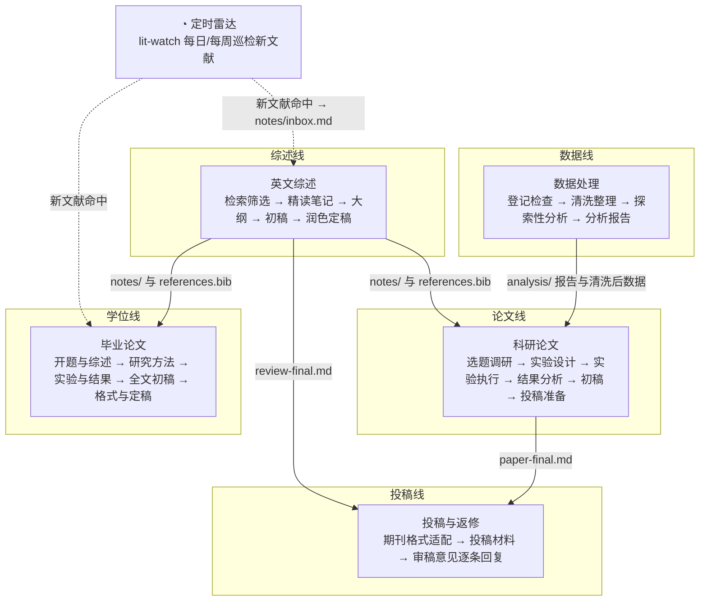
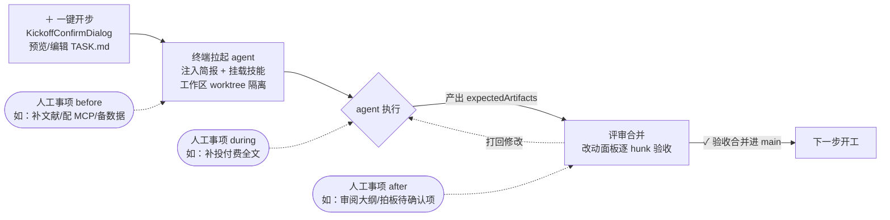
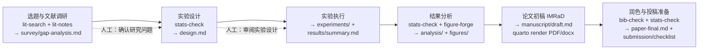
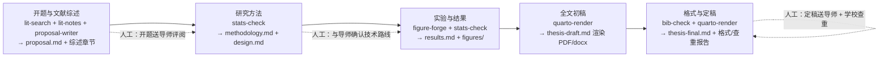
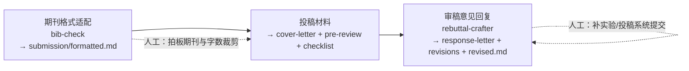

# 科研操作流程图

基于 Ccode 五套内置流水线模板（`src/pipeline-presets.ts`）绘制的科研操作流程。
核心分工：**AI 负责干活，Ccode 负责管活，人负责拍板**。

## 一、总览：五套流水线与接壤关系



## 二、单个步骤的执行闭环（所有步骤通用）

每一步都是「开工确认 → agent 干活 → 人拍板 → 评审合并」的闭环：



关键规则：

- 简报三写死：输入路径写死、决策规则写死（拿不准一律纳入标「待确认」）、交付标准写死
- 拿不准的不裁掉：标 `[待确认]` / `[待核实]` / `[待补实验]`，留人拍板
- 原始数据与原始结果全程只读 / 进产物目录，不进 git
- 引用只用 `references.bib` 已有键，严禁编造文献

## 三、各流水线步骤链

### 英文综述

```mermaid
flowchart LR
    S1[文献检索与筛选<br/>lit-search<br/>→ papers/screening·included·to-fetch] --> S2[文献精读与笔记<br/>lit-notes<br/>→ notes/ + references.bib]
    S2 --> S3[综述大纲<br/>review-framework<br/>→ outline.md]
    S3 --> S4[综述初稿<br/>review-writing<br/>→ manuscript/draft.md]
    S4 --> S5[润色与定稿<br/>review-writing + bib-check<br/>→ review-final.md + changelog]
    S3 -.->|人工：审阅大纲再开初稿| S4
    S5 -.->|人工：核对 [待核实] 条目| S5
```

### 科研论文



### 数据处理

```mermaid
flowchart LR
    D1[数据登记与检查<br/>→ data-dictionary.md<br/>原始数据全程只读] --> D2[清洗与整理<br/>data-clean<br/>规则先行 → cleaning/]
    D2 --> D3[探索性分析<br/>data-eda + stats-check<br/>→ figures/ + eda-report.md]
    D3 --> D4[分析报告<br/>→ analysis-report.md<br/>建议与发现一一对应]
    D2 -.->|人工：拍板 [待确认] 清洗规则| D2
```

### 毕业论文



### 投稿与返修


